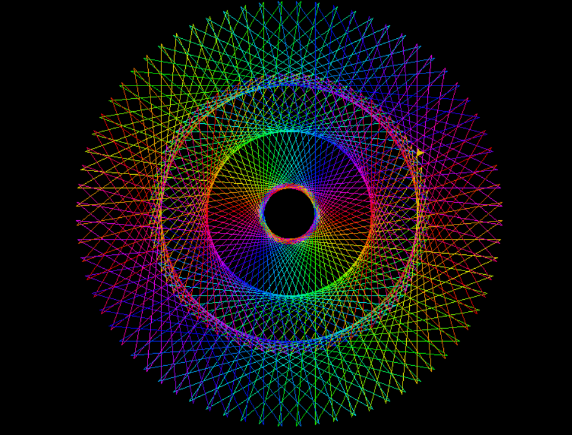

# Colored Circles in Python
## Descripción
Aquí aprenderás cómo hacer un creador de patrones de círculos coloridos con **Python** usando **Turtle**, estos patrones forman estrellas de 5 puntas de la cual se va recorriendo hacia la derecha teniendo el pivote en el centro de la pantalla.

## Requisitos
Principalmente verificar que tengas estos recursos instalados en tu ordenador:

|Software    |      Version          |            Recursos                                     |
|------------|-----------------------|---------------------------------------------------------|
| Python     |      Python 3.10      | [Descargar Python](https://www.python.org/downloads/)   |
|Editor Texto|       VSC 1.62        | [Descargar VSC](https://code.visualstudio.com/Download) |
|            |                       |                                                         |

## Instrucciones
Una vez que tengas instalado lo necesario, seguiremos con la ejecución del programa:
1. Nos dirijimos a la carpeta donde esté el programa.
2. Abrimos la terminal con la ubicación del archivo.
3. Ejecutamos el siguiente comando:
    - **Linux**: `python3 app.py`
    - **Windows**: `py app.py`

4. Se abirá una nueva terminal donde se mostrará el programa funcionando.
5. Finalizar el programa manualmente, ya sea cerrando la ventana o usando el comando **CTRL + C**
---
## Resultado final

---
### Contribuidores
- [@ManuOSMx](https://github.com/manuosmx)
